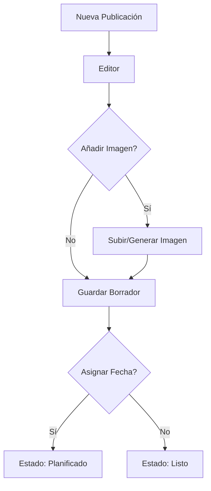
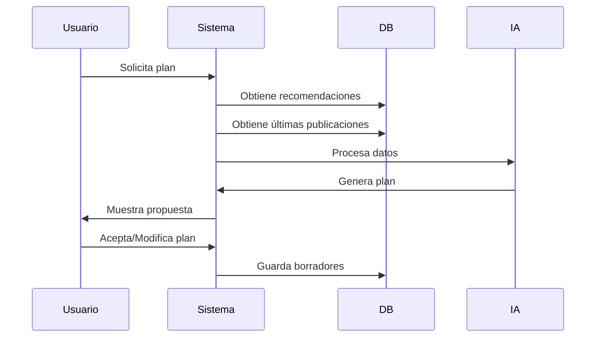
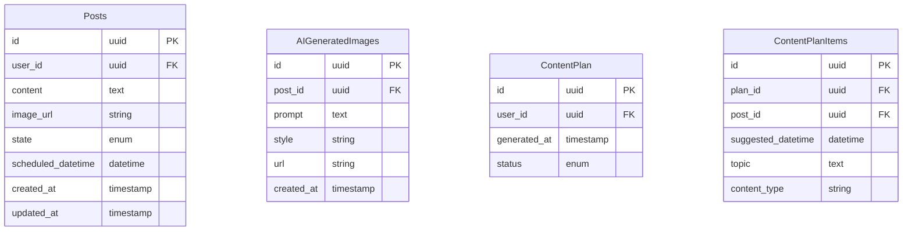

# PRD - Planificador de Contenidos Linksight

## 1. Visión General
El Planificador de Contenidos de Linksight es una nueva funcionalidad que permite a los usuarios gestionar y planificar sus publicaciones de LinkedIn de manera efectiva, aprovechando la IA para optimizar el contenido y mantener una presencia consistente en la plataforma.

## 2. Objetivos
- Facilitar la gestión y organización de ideas y borradores de contenido
- Permitir la planificación temporal de publicaciones
- Aprovechar la IA para generar planes de contenido personalizados
- Asistir en la creación de contenido manteniendo el estilo personal del usuario

## 3. Funcionalidades Detalladas

### 3.1 Gestor de Publicaciones

#### Lista de Publicaciones
- **Vista Principal**
  - Listado de publicaciones ordenado por fecha
  - Filtros por estado (Borrador, Listo, Planificado)
  - Ordenación por fecha de creación/modificación/planificación

#### Estados de Publicación
- **Borrador**: Estado inicial al crear una publicación
- **Listo**: Contenido finalizado pero sin fecha asignada
- **Planificado**: Asignado automáticamente al establecer fecha/hora
  
#### Editor de Contenido
- **Funcionalidades Base**
  - Editor de texto enriquecido
  - Soporte para emojis
  - Contador de caracteres
  - Sistema de autoguardado

- **Gestión de Imágenes**
  - Subida de imágenes desde dispositivo
  - Generación de imágenes con IA
    - Selección de estilo visual (realista, 3D, pixar)
    - Descripción textual de la imagen deseada
    - Previsualización y regeneración

### 3.2 Vista Calendario

#### Características
- **Vistas Disponibles**
  - Vista Semanal
  - Vista Mensual
- **Visualización**
  - Solo muestra publicaciones en estado "Planificado"
  - Indicador visual de publicaciones por día
  - Preview rápido al hover sobre publicación

#### Interacciones
- Navegación entre meses/semanas
- Click en día para ver detalle de publicaciones
- Click en publicación para editar

### 3.3 Funcionalidades IA

#### Generador de Plan de Contenidos
- **Inputs**
  - Recomendaciones existentes del usuario
    ```sql
    Table: recommendations
    - id
    - user_id
    - date_generated
    - tipos_de_contenido
    - mejores_horarios
    - longitud_optima
    - frecuencia_recomendada
    - estrategias_de_engagement
    ```
  - Últimas 30 publicaciones del usuario

- **Outputs**
  - Plan de publicaciones sugerido
    - Frecuencia basada en recomendaciones
    - Tipos de contenido variados
    - Horarios optimizados
    - Temas sugeridos

#### Generador de Contenido IA
- **Análisis de Estilo**
  - Procesamiento de publicaciones anteriores
  - Identificación de tono y voz
  - Patrones de escritura

- **Generación de Contenido**
  - Mantiene consistencia con estilo del usuario
  - Opciones de regeneración
  - Vista comparativa (original vs IA)
  - Editor para modificaciones

## 4. Flujos de Usuario

### 4.1 Crear Nueva Publicación


### 4.2 Generar Plan de Contenidos


## 5. Modelo de Datos



## 6. Requisitos No Funcionales

### 6.1 Rendimiento
- Tiempo de guardado < 1 segundo
- Generación de plan de contenido < 30 segundos
- Generación de imagen IA < 15 segundos
- Carga de calendario < 2 segundos

### 6.2 Almacenamiento
- Soporte para imágenes hasta 5MB
- Almacenamiento de historial de versiones (30 días)
- Caché de planes generados (24 horas)

### 6.3 Seguridad
- Encriptación de contenido en tránsito y reposo
- Validación de propiedad de imágenes
- Rate limiting para generación IA

## 7. Métricas de Éxito
- % de usuarios que crean al menos 5 borradores/mes
- % de usuarios que utilizan la generación de planes
- Tiempo promedio de creación de contenido
- Tasa de adopción de sugerencias IA
- Engagement de posts generados vs manuales

## 8. Fases de Implementación

### Fase 1: Funcionalidades Base
- Sistema de borradores
- Editor básico
- Vista de lista
- Estados de publicación

### Fase 2: Planificación
- Vista calendario
- Programación de publicaciones
- Gestión de imágenes básica

### Fase 3: Integración IA
- Generación de planes
- Asistente de contenido
- Generación de imágenes

## 9. Consideraciones Futuras
- Integración con otras redes sociales
- Templates de contenido
- Análisis de sentimiento
- Colaboración en equipo
- API para integraciones externas