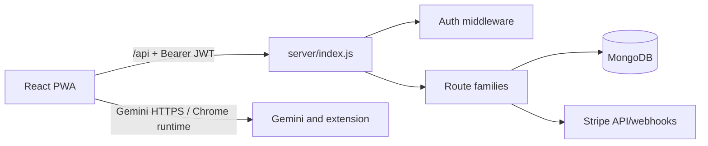

# Runtime architecture

`src/main.tsx` mounts the React app; `src/App.tsx` owns routing and protected layout. Vite proxies `/api` to `http://localhost:3001` during development. `server/index.js` loads `server/.env`, connects through `config/db.js`, installs CORS/body/error middleware, mounts route families, and serves `dist` in production. Mongo models in `server/models` are the persistence boundary.

The request order matters: `/api/stripe/webhook` receives `express.raw` before the global JSON parser so Stripe signatures can be verified. All other requests use JSON up to 10 MB. Authentication attaches `req.user` and `req.userId`; route handlers must apply user ownership filters themselves. See [API overview](../backend/api-overview.md), [data models](../data-models.md), and [AI integration](../integrations/ai-and-extension.md).

The frontend stores its session in `localStorage` under `linksight_auth`; `ApiClient` adds the access token and retries one 401 after refresh. `useAuth` refreshes on startup and every ten minutes. Production can be served by `server/index.js`; the separate root `server.js` only serves static `dist` on port 3000, so deployment configuration must select deliberately.
